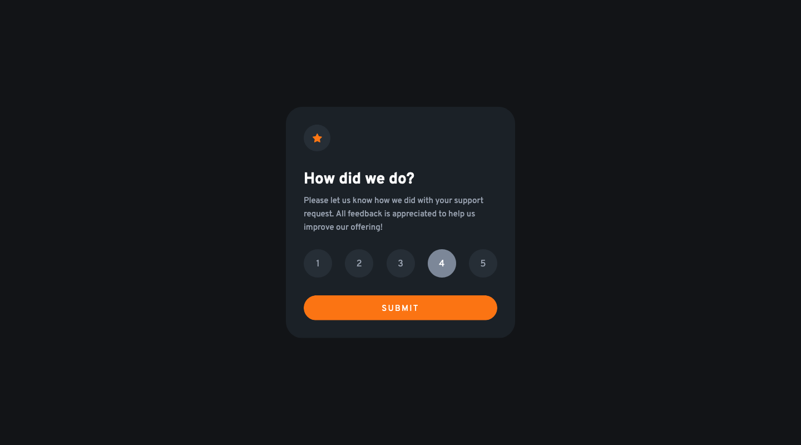

# Frontend Mentor - Interactive Rating Component Solution

This is a solution to the [Interactive Rating Component Challenge on Frontend Mentor](https://www.frontendmentor.io/challenges/interactive-rating-component-koxpeBUmI). Frontend Mentor challenges help you improve your coding skills by building realistic projects. 

## The challenge

Users should be able to:

- View the optimal layout for the app depending on their device's screen size
- See hover states for all interactive elements on the page
- Select and submit a number rating
- See the "Thank you" card state after submitting a rating

## Screenshots

### Front

### Back

## Built with

- Semantic HTML5 markup
- CSS custom properties
- Flexbox
- Mobile-first workflow
- [React](https://reactjs.org/) - JS library

## What I learned

This wasn't a very difficult project for me, but I just wanted to do something simple to remind myself how to implement React as it's been a while. I increased the difficulty by including more complicated transitions (such as the card flipping when the form is submitted).

## Continued development

Not sure what I will do next but I'm trying to learn something new with each project.